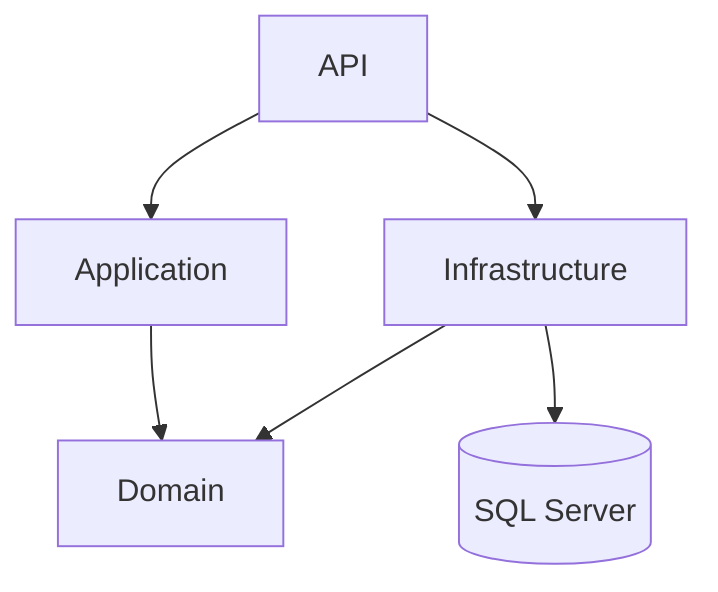
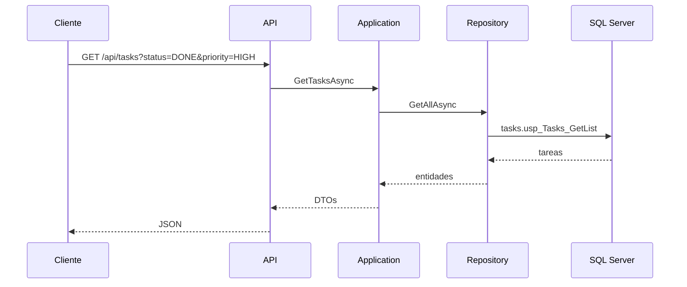

# Notas de arquitectura

El reto es chico, pero lo separé en capas para no dejar todo en `Program.cs`. La API queda como entrada HTTP, Application concentra el caso de uso y Infrastructure se encarga de SQL Server.

## Capas



- `API`: endpoints, Swagger y middleware de errores.
- `Application`: validación de filtros y armado de respuestas.
- `Domain`: entidades y contratos de repositorios.
- `Infrastructure`: Dapper, conexión SQL y llamadas a stored procedures.

## Flujo de una consulta



## Cosas que decidí

### Stored procedures

Los repositorios no tienen SQL inline. Llaman a los SPs del script:

```text
tasks.usp_Tasks_GetList
tasks.usp_Tasks_GetById
tasks.usp_FilterOptions_Get
```

Esto también deja alineado el código con el requisito del PDF.

### Catálogos

Prioridades y estados están en tablas aparte. Preferí eso antes que guardar textos libres en `Tasks`, porque los mismos valores se usan para filtros, respuestas y validación.

### Filtros con código

La API usa `PENDING`, `DONE`, `HIGH`, etc. Los ids quedan adentro de la base y no se filtran hacia el contrato HTTP.

### Errores

Hay un middleware para no repetir `try/catch` en cada endpoint. Los filtros inválidos salen como `400` y el resto como `500` genérico.

### Tests

Los tests van contra Application con repositorios falsos. No prueban SQL Server; prueban reglas de negocio y mapeo básico.
