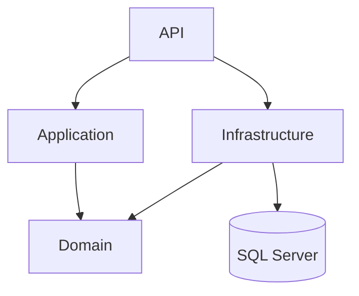
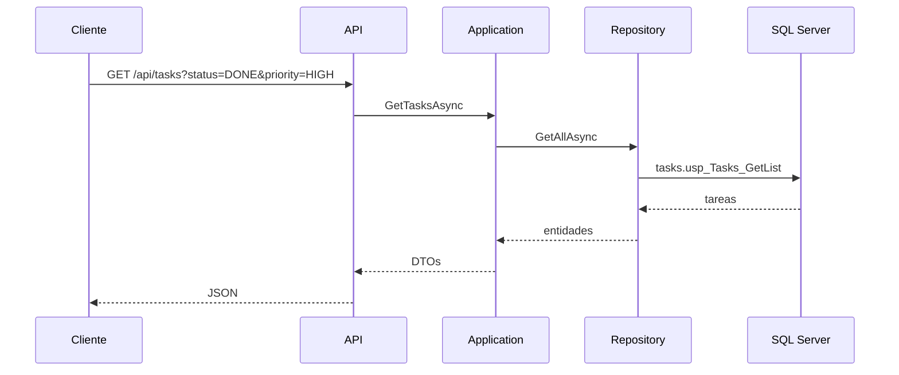
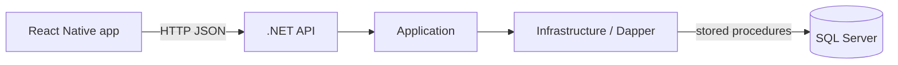

# Notas de arquitectura

La idea fue resolver el reto sin dejar todo mezclado en un solo archivo. El proyecto es chico, pero lo arme con capas para que quede claro donde vive cada responsabilidad.

## Capas



- `API`: controllers, Swagger, health check y middleware de errores.
- `Application`: casos de uso, validaciones, DTOs y mapeos.
- `Domain`: entidades y contratos de repositorio.
- `Infrastructure`: Dapper, conexion SQL Server y llamadas a stored procedures.

## Flujo de una consulta



## Comunicacion app/API/DB



En Android uso `10.0.2.2:5080` porque el emulador no llega al `localhost` de Windows directamente. Esa diferencia quedo aislada en `frontend/src/config/env.ts`.

## Frontend

La app esta separada por feature para que `App.tsx` no concentre toda la logica:

```text
src/api/                 cliente HTTP y endpoints
src/components/          UI compartida
src/domain/              tipos del contrato
src/features/tasks/
  components/            cards y filtros
  hooks/                 carga de tareas, filtros y detalle
  screens/               listado y detalle
src/navigation/          stack principal y tipos de rutas
src/theme/               colores, espaciados, fuentes y badges
src/styles/              estilos compartidos
```

No use UI Kit. La idea fue mantener componentes propios y simples: lista, filtros, estados de carga/error/vacio y detalle.

## Decisiones

### Stored procedures

Los repositorios no tienen SQL inline para las consultas principales. Llaman a los SPs del script:

```text
tasks.usp_Tasks_GetList
tasks.usp_Tasks_GetById
tasks.usp_FilterOptions_Get
```

Esto deja el backend alineado con el requisito de usar procedimientos almacenados.

### Catalogos

Prioridades y estados estan en tablas aparte. Preferi eso antes que guardar textos libres en `Tasks`, porque esos valores se usan para filtros, validaciones y respuestas.

### Filtros por codigo

La API filtra por codigos (`PENDING`, `DONE`, `HIGH`, etc.). Los ids internos quedan en la base y no forman parte del contrato HTTP.

### Contratos de tareas

El listado y el detalle tienen DTOs separados:

```text
TaskListItemDto
TaskDetailDto
```

Hoy comparten campos, pero quedan separados para que el detalle pueda crecer sin cambiar la respuesta del listado.

### Errores

Hay un middleware para centralizar errores. Las validaciones devuelven `400`, una tarea inexistente devuelve `404` y los errores no controlados devuelven `500` generico.

### Tests

Los tests del backend van contra Application con repositorios falsos. No prueban SQL Server; prueban reglas de negocio, validaciones y mapeos.

En el frontend deje tests de la capa API, typecheck, lint y check de formato. La cobertura apunta a la parte mas sensible del front: rutas, query strings y manejo de errores al consumir la API.
