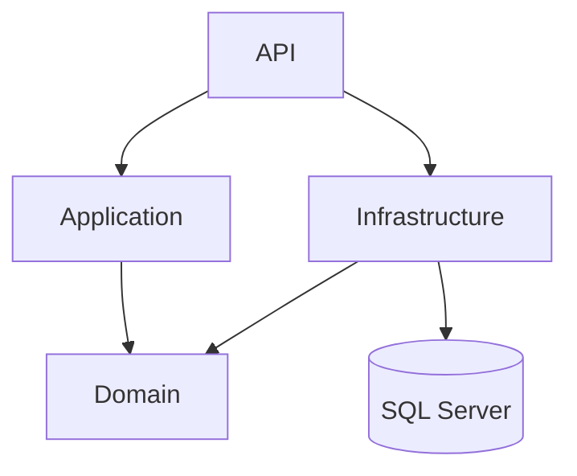
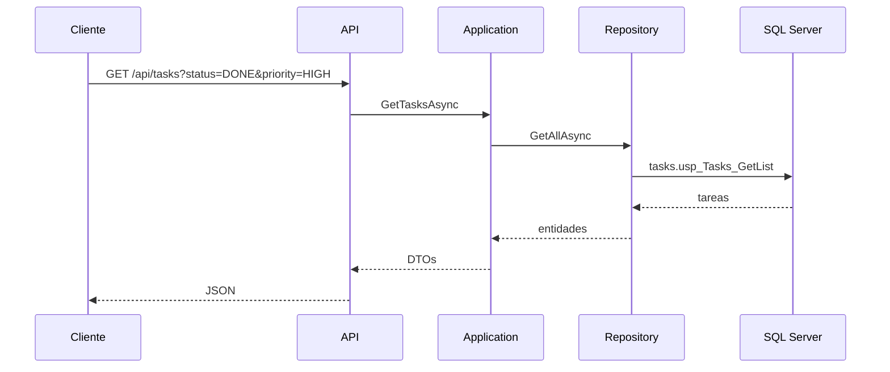
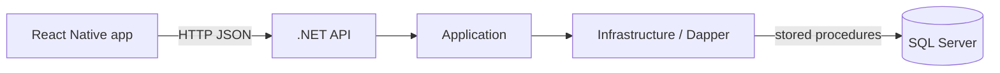

# Notas de arquitectura

El reto es chico, pero lo separé en capas para no dejar todo en `Program.cs`. La API queda como entrada HTTP, Application concentra el caso de uso y Infrastructure se encarga de SQL Server.

## Capas



- `API`: controllers, Swagger y middleware de errores.
- `Application`: validación de filtros y armado de respuestas.
- `Domain`: entidades y contratos de repositorios.
- `Infrastructure`: Dapper, conexión SQL y llamadas a stored procedures.

## Flujo de una consulta



## Comunicación app/API/DB



En Android, la app usa `10.0.2.2:5080` para llegar al backend local. En el código quedó separado en `frontend/src/config/env.ts`.

## Frontend

La app quedó organizada por feature para que no dependa todo de `App.tsx`:

```text
src/api/                 cliente HTTP y endpoints
src/components/          UI compartida
src/domain/              tipos del contrato
src/features/tasks/
  components/            cards y filtros
  hooks/                 carga de tareas, filtros y detalle
  screens/               listado y detalle
src/navigation/          stack principal y tipos de rutas
src/theme/               colores, espaciados, tipografía y badges
src/styles/              estilos compartidos
```

No se usa UI Kit. Los componentes son propios y consumen la API real: listado, filtros y detalle. La navegación entre pantallas queda en un stack de React Navigation.

## Cosas que decidí

### Stored procedures

Los repositorios no tienen SQL inline. Llaman a los SPs del script:

```text
tasks.usp_Tasks_GetList
tasks.usp_Tasks_GetById
tasks.usp_FilterOptions_Get
```

Esto también deja alineado el código con el requisito del PDF.

### Catálogos

Prioridades y estados están en tablas aparte. Preferí eso antes que guardar textos libres en `Tasks`, porque los mismos valores se usan para filtros, respuestas y validación.

### Filtros con código

La API usa `PENDING`, `DONE`, `HIGH`, etc. Los ids quedan adentro de la base y no se filtran hacia el contrato HTTP.

### Contratos de tareas

El listado y el detalle usan DTOs separados (`TaskListItemDto` y `TaskDetailDto`). Hoy comparten campos, pero quedan desacoplados para poder evolucionar cada respuesta sin tocar la otra.

### Errores

Hay un middleware para no repetir `try/catch` en cada endpoint. Las validaciones salen como `400`, los recursos inexistentes como `404` y el resto como `500` generico.

### Tests

Los tests van contra Application con repositorios falsos. No prueban SQL Server; prueban reglas de negocio y mapeo básico.
